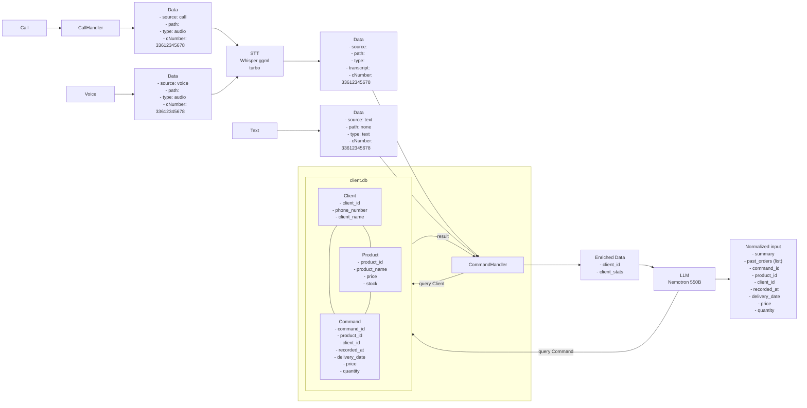

# Architecture - stockline-ai (Mermaid)

Source sketch: image from Ivann Kamdem, 22/11.

```mermaid
flowchart LR
    Call["&nbsp;&nbsp;&nbsp;&nbsp;&nbsp;&nbsp;&nbsp;Call&nbsp;&nbsp;&nbsp;&nbsp;&nbsp;&nbsp;&nbsp;"]
    Voice["&nbsp;&nbsp;&nbsp;&nbsp;&nbsp;&nbsp;&nbsp;Voice&nbsp;&nbsp;&nbsp;&nbsp;&nbsp;&nbsp;&nbsp;"]
    Text["&nbsp;&nbsp;&nbsp;&nbsp;&nbsp;&nbsp;&nbsp;Text&nbsp;&nbsp;&nbsp;&nbsp;&nbsp;&nbsp;&nbsp;"]

    Call --> CH["&nbsp;&nbsp;&nbsp;&nbsp;&nbsp;&nbsp;CallHandler&nbsp;&nbsp;&nbsp;&nbsp;&nbsp;&nbsp;"]

    CH --> CD["&nbsp;&nbsp;&nbsp;&nbsp;Data&nbsp;&nbsp;&nbsp;&nbsp;<br/>&nbsp;&nbsp;&nbsp;&nbsp;- source: call&nbsp;&nbsp;&nbsp;&nbsp;<br/>&nbsp;&nbsp;&nbsp;&nbsp;- path: &nbsp;&nbsp;&nbsp;&nbsp;<br/>&nbsp;&nbsp;&nbsp;&nbsp;- type: audio&nbsp;&nbsp;&nbsp;&nbsp;<br/>&nbsp;&nbsp;&nbsp;&nbsp;- cNumber: 33612345678&nbsp;&nbsp;&nbsp;&nbsp;"]
    Voice --> VD["&nbsp;&nbsp;&nbsp;&nbsp;Data&nbsp;&nbsp;&nbsp;&nbsp;<br/>&nbsp;&nbsp;&nbsp;&nbsp;- source: voice&nbsp;&nbsp;&nbsp;&nbsp;<br/>&nbsp;&nbsp;&nbsp;&nbsp;- path: &nbsp;&nbsp;&nbsp;&nbsp;<br/>&nbsp;&nbsp;&nbsp;&nbsp;- type: audio&nbsp;&nbsp;&nbsp;&nbsp;<br/>&nbsp;&nbsp;&nbsp;&nbsp;- cNumber: 33612345678&nbsp;&nbsp;&nbsp;&nbsp;"]
    Text --> TD["&nbsp;&nbsp;&nbsp;&nbsp;Data&nbsp;&nbsp;&nbsp;&nbsp;<br/>&nbsp;&nbsp;&nbsp;&nbsp;- source: text&nbsp;&nbsp;&nbsp;&nbsp;<br/>&nbsp;&nbsp;&nbsp;&nbsp;- path: none&nbsp;&nbsp;&nbsp;&nbsp;<br/>&nbsp;&nbsp;&nbsp;&nbsp;- type: text&nbsp;&nbsp;&nbsp;&nbsp;<br/>&nbsp;&nbsp;&nbsp;&nbsp;- cNumber: 33612345678&nbsp;&nbsp;&nbsp;&nbsp;"]

    CD --> STT["&nbsp;&nbsp;&nbsp;&nbsp;STT&nbsp;&nbsp;&nbsp;&nbsp;<br/>&nbsp;&nbsp;&nbsp;&nbsp;Whisper ggml&nbsp;&nbsp;&nbsp;&nbsp;<br/>&nbsp;&nbsp;&nbsp;&nbsp;turbo&nbsp;&nbsp;&nbsp;&nbsp;"]
    VD --> STT

    STT --> TR["&nbsp;&nbsp;&nbsp;&nbsp;Data&nbsp;&nbsp;&nbsp;&nbsp;<br/>&nbsp;&nbsp;&nbsp;&nbsp;- source: &nbsp;&nbsp;&nbsp;&nbsp;<br/>&nbsp;&nbsp;&nbsp;&nbsp;- path: &nbsp;&nbsp;&nbsp;&nbsp;<br/>&nbsp;&nbsp;&nbsp;&nbsp;- type: &nbsp;&nbsp;&nbsp;&nbsp;<br/>&nbsp;&nbsp;&nbsp;&nbsp;- transcript: &nbsp;&nbsp;&nbsp;&nbsp;<br/>&nbsp;&nbsp;&nbsp;&nbsp;- cNumber: 33612345678&nbsp;&nbsp;&nbsp;&nbsp;"]

    subgraph DB["&nbsp;&nbsp;&nbsp;&nbsp;&nbsp;&nbsp;client.db&nbsp;&nbsp;&nbsp;&nbsp;&nbsp;&nbsp;"]
        direction TB
        T_CLIENT["&nbsp;&nbsp;&nbsp;&nbsp;Client&nbsp;&nbsp;&nbsp;&nbsp;<br/>&nbsp;&nbsp;&nbsp;&nbsp;- client_id&nbsp;&nbsp;&nbsp;&nbsp;<br/>&nbsp;&nbsp;&nbsp;&nbsp;- phone_number&nbsp;&nbsp;&nbsp;&nbsp;<br/>&nbsp;&nbsp;&nbsp;&nbsp;- client_name&nbsp;&nbsp;&nbsp;&nbsp;"]
        T_PRODUCT["&nbsp;&nbsp;&nbsp;&nbsp;Product&nbsp;&nbsp;&nbsp;&nbsp;<br/>&nbsp;&nbsp;&nbsp;&nbsp;- product_id&nbsp;&nbsp;&nbsp;&nbsp;<br/>&nbsp;&nbsp;&nbsp;&nbsp;- product_name&nbsp;&nbsp;&nbsp;&nbsp;<br/>&nbsp;&nbsp;&nbsp;&nbsp;- price&nbsp;&nbsp;&nbsp;&nbsp;<br/>&nbsp;&nbsp;&nbsp;&nbsp;- stock&nbsp;&nbsp;&nbsp;&nbsp;"]
        T_ORDER["&nbsp;&nbsp;&nbsp;&nbsp;Command&nbsp;&nbsp;&nbsp;&nbsp;<br/>&nbsp;&nbsp;&nbsp;&nbsp;- command_id&nbsp;&nbsp;&nbsp;&nbsp;<br/>&nbsp;&nbsp;&nbsp;&nbsp;- product_id&nbsp;&nbsp;&nbsp;&nbsp;<br/>&nbsp;&nbsp;&nbsp;&nbsp;- client_id&nbsp;&nbsp;&nbsp;&nbsp;<br/>&nbsp;&nbsp;&nbsp;&nbsp;- recorded_at&nbsp;&nbsp;&nbsp;&nbsp;<br/>&nbsp;&nbsp;&nbsp;&nbsp;- delivery_date&nbsp;&nbsp;&nbsp;&nbsp;<br/>&nbsp;&nbsp;&nbsp;&nbsp;- price&nbsp;&nbsp;&nbsp;&nbsp;<br/>&nbsp;&nbsp;&nbsp;&nbsp;- quantity&nbsp;&nbsp;&nbsp;&nbsp;"]
        T_CLIENT --- T_PRODUCT
        T_CLIENT --- T_ORDER
        T_PRODUCT --- T_ORDER
    end

    CMD["&nbsp;&nbsp;&nbsp;&nbsp;&nbsp;&nbsp;CommandHandler&nbsp;&nbsp;&nbsp;&nbsp;&nbsp;&nbsp;"]
    TR --> CMD
    TD --> CMD

    subgraph IO[" "]
        direction LR
        CMD -->|"query Client"| DB
        DB -->|"result"| CMD
    end

    CMD --> ENR["&nbsp;&nbsp;&nbsp;&nbsp;Enriched Data&nbsp;&nbsp;&nbsp;&nbsp;<br/>&nbsp;&nbsp;&nbsp;&nbsp;- client_id&nbsp;&nbsp;&nbsp;&nbsp;<br/>&nbsp;&nbsp;&nbsp;&nbsp;- client_stats&nbsp;&nbsp;&nbsp;&nbsp;"]
    ENR --> LLM["&nbsp;&nbsp;&nbsp;&nbsp;LLM&nbsp;&nbsp;&nbsp;&nbsp;<br/>&nbsp;&nbsp;&nbsp;&nbsp;Nemotron 550B&nbsp;&nbsp;&nbsp;&nbsp;"]
    LLM -->|"query Command"| DB
    LLM --> NORM["&nbsp;&nbsp;&nbsp;&nbsp;Normalized input&nbsp;&nbsp;&nbsp;&nbsp;<br/>&nbsp;&nbsp;&nbsp;&nbsp;- summary&nbsp;&nbsp;&nbsp;&nbsp;<br/>&nbsp;&nbsp;&nbsp;&nbsp;- past_orders (list)&nbsp;&nbsp;&nbsp;&nbsp;<br/>&nbsp;&nbsp;&nbsp;&nbsp;&nbsp;&nbsp;- command_id&nbsp;&nbsp;&nbsp;&nbsp;<br/>&nbsp;&nbsp;&nbsp;&nbsp;&nbsp;&nbsp;- product_id&nbsp;&nbsp;&nbsp;&nbsp;<br/>&nbsp;&nbsp;&nbsp;&nbsp;&nbsp;&nbsp;- client_id&nbsp;&nbsp;&nbsp;&nbsp;<br/>&nbsp;&nbsp;&nbsp;&nbsp;&nbsp;&nbsp;- recorded_at&nbsp;&nbsp;&nbsp;&nbsp;<br/>&nbsp;&nbsp;&nbsp;&nbsp;&nbsp;&nbsp;- delivery_date&nbsp;&nbsp;&nbsp;&nbsp;<br/>&nbsp;&nbsp;&nbsp;&nbsp;&nbsp;&nbsp;- price&nbsp;&nbsp;&nbsp;&nbsp;<br/>&nbsp;&nbsp;&nbsp;&nbsp;&nbsp;&nbsp;- quantity&nbsp;&nbsp;&nbsp;&nbsp;"]
```
